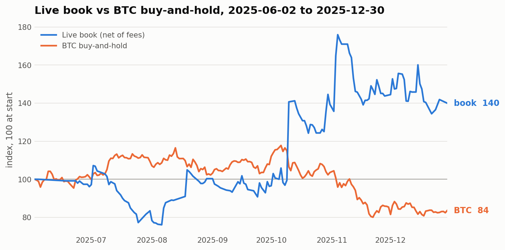
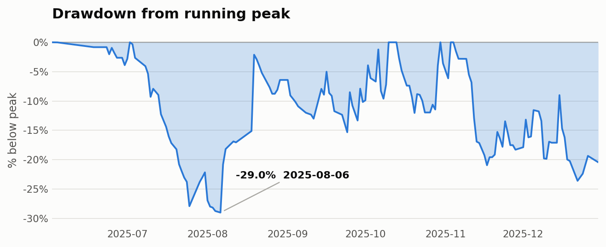
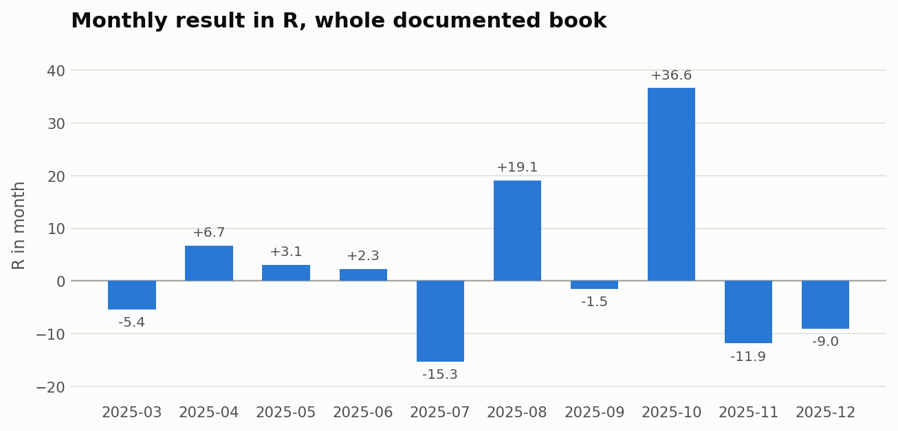
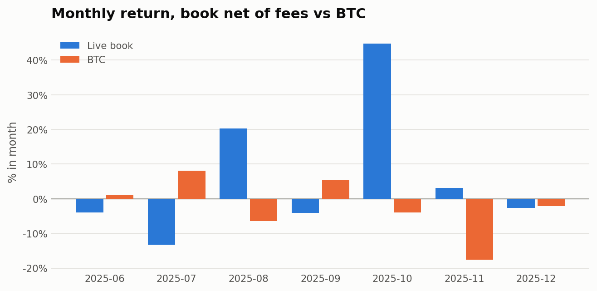
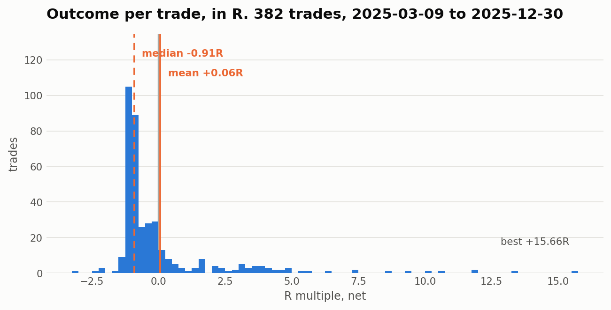

# 02. Performance

Figures recomputed from source by `scripts/build_blotter.py` and
`scripts/join_blotter.py`. Nothing on this page is copied from a previous summary.

## Headline

| | Documented book | Venue-verified |
|---|---|---|
| Window (UTC) | 2025-03-09 to 2025-12-30 | 2025-06-02 to 2025-12-30 |
| Source | manual trade log | KCEX export |
| Trades | 382 | 391 closing fills |
| Result | **+24.71R** | **+5,993 USDT net** |
| Return on 15,000 starting capital | | **+40.0%** |
| BTC, same window | | **-16%** |
| Max drawdown, % of peak | | **-29.0%** (2025-08-06) |
| Max drawdown, USDT | | **-6,231** (2025-11-04 to 2025-12-22, not recovered) |
| Win rate | 23.0% | 30.7% |
| Payoff, avg win / avg loss | 3.64 | 2.69 |
| Profit factor | | 1.19 |
| Best / worst trade | +15.66R / -3.21R | +2,429 / -892 USDT |

Over the venue window alone the log records **+20.31R**; the remaining +4.40R is
the March-to-May ramp, which the venue export does not cover.







## Concentration

```
2025-10-10                  +6,182 USDT   = 103% of the venue window's net
top 3 days                                = 212% of net
Aug +19.1R and Oct +36.6R                 = 225% of the year's +24.71R
```

Remove 2025-10-10 and the venue window is net negative. Remove August and
October and the documented book is **-31R**.

This is the expected result of the design rather than a flaw in it. A 23% win
rate with a 3.64 payoff is a convex book, and a convex book earns in the tail by
construction. If the tail pays, removing the tail has to leave a loss, and a book
of this shape showing evenly distributed monthly profits would be evidence that
something other than the intended edge was driving the returns.

What it does cost me is sample size
382 trades is a reasonable sample for the win rate and for the average loss,
because those are measured on the 294 trades that lost. It is a poor sample for
the payoff, which is what makes the book profitable and which is carried by
roughly a dozen trades across two volatile months. The honest reading is that the
loss side of this book is well measured and the profit side is not yet.

That is why the repeatability test is stated in events rather than in trades. I
need another 6 to 12 months live, containing volatility regimes I have not
already traded, and the question is whether the tail still arrives and still gets
captured.

## Monthly

Ten months in the documented book, five positive. Two of them, August and
October, carry it. Both were volatile months with downside moves and strong
intraday momentum, which is what my intraday momentum-based strategies are built
for.

Full aggregate in `data/public_monthly_stats.csv`.

## Sample size

- 382 trades, 10 months, one instrument, one venue
- 391 closing fills and 146 trading days on the venue-verified part
- Roughly two genuine volatility events

Still too small a sample to claim a consistently proven live edge, but a good
start and a fair showing of what I am doing in order to outperform the market.
